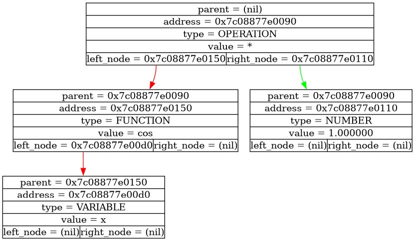
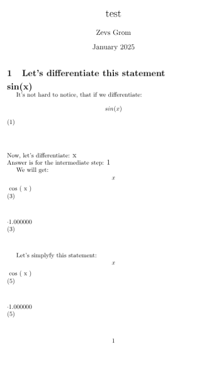

# Taylor(Differentiator)


## 📖 About the Project

This project is one of the **main steps** in the [Ilya Dedinskiy's](https://vk.com/ded32_ru) course of C-language. It unites knowledge and skills purchased by the previous tasks and projects. The aim of this project use trees for creating **automatic** expression parser and analyzer! It can not only just calculate some simple expression, it can **differentiate expression**!

## Legend of Inspiration
This project is named after the famous mathematician *Taylor*, who made life easier for everyone by inventing the decomposition of complex functions into infinite series). This project uses one of the most interesting and important techniques in world programming! It's a **Recursive Descent**. So, I can say, that this project can be called as the preparation for something more cool)

---

## ✨ Features

* 📂 Reads and processes math expressions from input file
* 🔤 Can operate not only just numbers, but math functions
* 🔁 Can be used as a separate library for some calculations
* ⚡  Use **Recursive Descent** for parsing to tree
* 💡 Use **Latex** for dumping all process of calculation
* 📄 Use **Custom errors**

---

## 🛠 Technologies Used

* **C**
* **g++**
* **Latex**
* **Makefile**
* **Standard Library**
* **Graphviz**
* **Custom Recursive Descent**

---

## 📂 Project Structure

```
Tailor/
│
├── dump/         # Pictures with steps of processing
├── source/       # Source files
├── include/      # Header files
├── build/        # Compiled binaries
├── tex_dump/     # Contains latex-report with all steps
├── Makefile      # Build configuration
└── README.md
```

---

## Deep discription of project

### Recursive Descent

I think, it's the main part of this project, since everything else has already been used before and has only been adapted to the necessary tasks.
From my point of view, the algorithm of Recursive Descent not very easy and some descriptions of it in the Internet are useless and inaccurate. I am really grateful Ilya Dedinskiy for his lection about it!

So in short, in simple words, in general, recursive descent recursively analyzes an expression, parses it, and saves it to a tree. 

In more advanced versions, there is also a special stage called **Lexical Analysis**, which consists in first parsing the expression into **tokens**, that is, separate blocks containing already processed data and then recursively saving it to a tree. In this project it isn't used.

You can see my implementation of it in the file ``source/tree_input.cpp``.

### Using trees

For processing data, which recursive descent parses, we use our old structure **tree**. Every node stores:
```
1. Address of parent_node
2. Address of node
3. Type of node
4. Value of node
5. Addresses of children
```

**What types of data do we have?**

1. Variable  - in this version it can be only 'x'
2. Number    - it can be both int or double
3. Operation - it can be '+', '-', '*', '/', '^'
4. Function  - it can be *sin* or *cos*

### Using Latex

Program use not only **graphviz** for visualization, but also **latex**! Implementation analyze all steps of process and create pdf report about them. You can it, if you open ``tex_dump/example.pdf`` after the program is completed.
It should be noted that the report is still far from perfect)

### Supported functionality

So, for using this instrument, you need to know, what it supports.
#### Simple calculation
You can use it for simple tasks of calculator. For example:
```
25 + 8 - 6$
```
```
(25 + 8) * (34 - 6)$
```

#### Testing
You can use it just for visualization. For this, you need to choose mode ``3 - test`` when you run the program(I will discuss it later).

#### Differentiation
I think the most greatful thing). You can differentiate complex functions!

```
sin(x)$
```


### Some visualizations




---

## ⚙️ Build and Run


### Clone the repository

```bash
git clone https://github.com/ZEVS1206/Tailor.git
cd Tailor
```

### Prepare your expression
Now you need to prepare your expression for analyze. For this, you need to open file ``source/input.txt`` and enter some expression for analyze. ⚠️⚠️⚠️**IMPORTANT** You need to add **$** to the end, of your expression, or all program will break!

### Build the project

```bash
make clean
make
```

### Run

```bash
make run
```

Then you can see visualization in folders ``dump`` and ``tex_dump``

---

## 📚 Educational Purpose

This project was created as part of a programming course to practice:

* skills of working with trees
* using the latex for creating reports
* implementation of **recursive descent**
* all previous knowledge and prepare for the next project)

---

## ⚠️ Important facts
1. In the last version, I haven't fixed the memory leaks issue yet(. Please be understanding.
2. ⚠️⚠️⚠️ You must not forget to write the $ symbol in the input file, otherwise everything will break!

---

## 📄 License

This project is licensed under the **MIT License**.

---

## 👨‍💻 Author

This project is a part of [Ilya Dedinskiy's](https://vk.com/ded32_ru) course of C-language!

Created by [Zevs](https://github.com/ZEVS1206)
